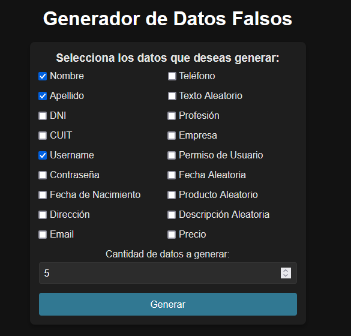
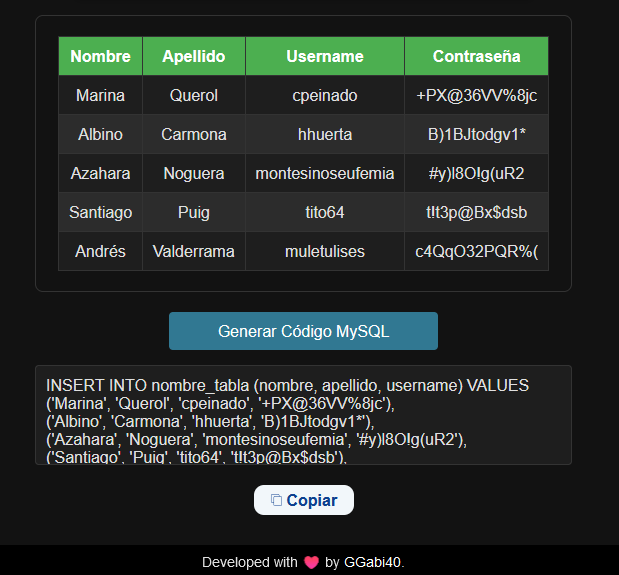

# FAKE DATA FOR DB

A project to generate fake data for your SQL databases.

[Visit it Online](https://fake-data-bbdd.vercel.app/)

---

## 📷 Preview

---

## 💻 Technologies

- HTML
- CSS
- JavaScript
- Flask
- Python
- Faker (for generating fake data)

---

## 📃 How to Use

1. Go to [https://fake-data-bbdd.vercel.app/](https://fake-data-bbdd.vercel.app/).
2. Select the options you need to generate fake data for your SQL code.
3. Copy the generated SQL code and use it directly in your database.

---

Developed with ♥️ by [GGabi40](https://github.com/ggabi40).
